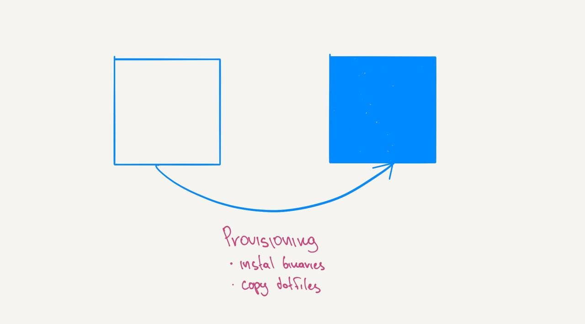

# How to automate setting up your developer environment?



1. Use package managers to install programs
2. Use config files to configure programs instead of UI
3. Store configuration in GitHub
4. Script installation and configuration

Check this out for example: [env-automation][env-automation]

## Avoid manual installation and use package managers

Use package managers to install the software and script the installation.

On mac use [`brew`](https://brew.sh/), on windows use [`choco`](https://chocolatey.org/).

```
brew cask install google-chrome spotify slack
```

## Prefer file-based configuration over UI based

Customize programs by using config files and not by changing settings in UI. It will allow you to script configuration. A simple bash script will copy files where needed and you are done.

```
cp ./init.vim ~/.config/nvim/init.vim
```

## Store configuration in git (Github)

Store all configuration in Github. It allows sharing configuration between machines and allows to go back in history if something is broken.

## Use scripts or provisioning tools for automation

Finally, write bash scripts or use Ansible like tools to automate the whole process. After this is done turning a new laptop into a fully usable machine will be a matter of one command.

```
brew install neovim
cp ./init.vim ~/.config/nvim/init.vim
```

[env-automation]: https://github.com/atsman/env-automation
