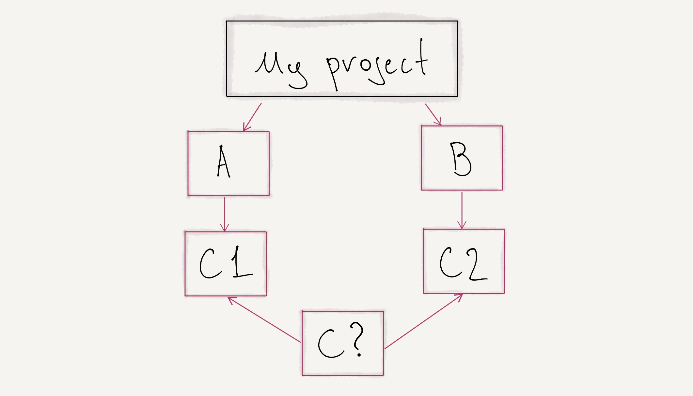

# How to exclude transient dependency in Clojure deps?



## Why you may need this?

Imagine a project with dependency A and B where A depends on Cv1 and B depends on Cv2. The deps tool doesn't know which version of C to use. You need to help it to resolve the correct version, your options:

1. Exclude C from A and allow deps to use the C version from B.
2. Exclude C from B and allow deps to use the C version from A.
3. Exclude C from both A and B, and make C your top-level dependency with a specific version.

## Ok, A B C whatever, how do I exclude dependency?

Add `:exclusions` vector on the same level as `:mvn/version`, in the next example `[cljsjs/react cljsjs/react-dom cljsjs/create-react-class]` going to be excluded:

```clojure
{:deps
  {:devcards {:mvn/version "0.2.7"
              :exclusions [cljsjs/react
                           cljsjs/react-dom
                           cljsjs/create-react-class]}}}
```
