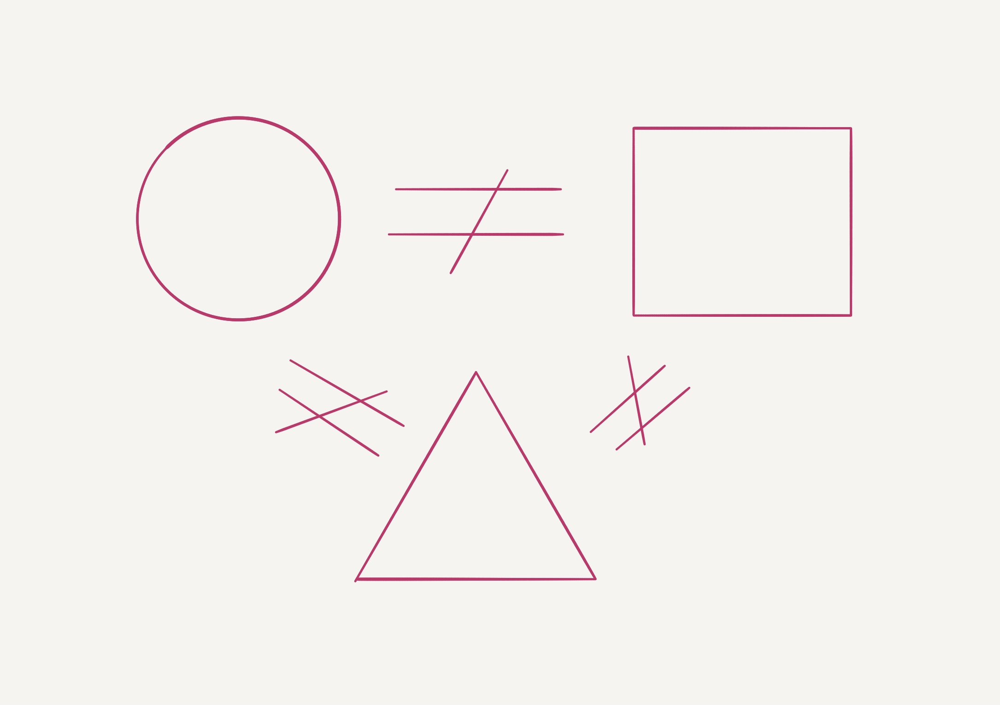

# When to use Type Aliases and Type Definitions in GO?



## When to use Type Aliases?

Use Type Aliases only during code base refactoring to move types between packages. [Codebase Refactoring (with help from Go)][CodebaseRefactoringGo]

## When to use Type Declaration?

Use Type Declaration to create enums and to add extra behaviour to basic types.

### 1. Constants using iota

Create new type with limited value range. It makes code more readable and safe:

```go
type Vehicle int

const (
    Bike Vehicle = iota
    Scooter
    Car
    Bus
    Train
)
```

### 2. Extra behaviour

Create new type to add extra behaviour. I would always question the need for this.

```go
type Person string

func (p Person) Hello(anotherPerson Person) {
    fmt.Printf("%s, Hello from %s", anotherPerson, p)
}

elon := Person("Elon Musk")
aleh := Person("Aleh")

elon.Hello(aleh) // Aleh, Hello from Elon Musk
```

[CodebaseRefactoringGo]: https://talks.golang.org/2016/refactor.article
